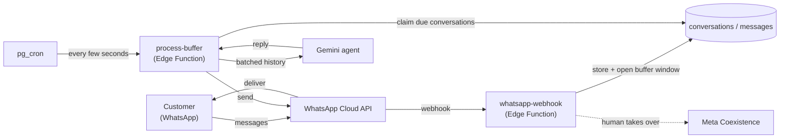

# Orocatto — Architecture

> A **multi-tenant** AI assistant for restaurants on WhatsApp. Each restaurant connects
> its own WhatsApp number; a Gemini-powered agent answers customers in natural language,
> with message batching (debounce), automatic hand-off to a human, and a per-restaurant
> persona. Built and operated end to end.

**Status:** Running in production · **Role:** Sole developer — architecture, implementation, and operations.

> 📄 This repository documents the **architecture** of Orocatto. The product source code
> is private; what's published here are the design, diagrams, and engineering decisions.

---

## At a glance

The system is **event-driven and serverless**: no always-on backend. Inbound messages are
stored immediately and a short **debounce window** is opened; a `pg_cron` job then flushes
each conversation as one coherent turn to the AI, and a human can take over at any moment.

---

## Documentation

| Document | What it covers |
|---|---|
| [Architecture](docs/architecture.md) | The system narrative — multi-tenancy, the debounce, the agent, and human hand-off. |
| [Diagrams](docs/diagrams.md) | System, sequence, and hand-off state diagrams. |
| [API](docs/api.md) | The Edge Functions and the WhatsApp webhook contract. |
| [Database](docs/database.md) | Data model (3 tables) and entity-relationship diagram. |

**Related module:** [pg-cron message debounce](#) — the buffering/debounce pattern, extracted as a standalone, sanitized module. *(link once published)*

---

## Tech stack

| Layer | Choice |
|---|---|
| Messaging | WhatsApp Cloud API (Meta), Graph API `v21.0` |
| Compute | Supabase Edge Functions (Deno) |
| Data + scheduling | Supabase Postgres, `pg_cron` |
| AI | Google Gemini (model fallback chain) |
| Human hand-off | Meta Coexistence + per-conversation kill switches |

---

## Scope

Orocatto is the **conversational layer**. The point-of-sale, menu, orders, delivery, and
in-person card payments (TEF) live in a **separate system** and are documented on their
own. Keeping the two apart is deliberate — this service does one thing: talk to customers.

---

*Built and operated by Bruno Lacerda. Orocatto is a product of Hive Tec.*