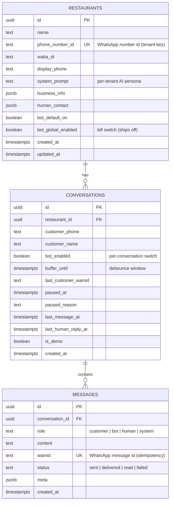

# Database

The model is deliberately small — three tables: **restaurants** (the tenants),
**conversations** (one WhatsApp thread per customer), and **messages** (the full history).
The debounce that powers the batching is not a table at all; it's a single timestamp
column on `conversations`. Row-Level Security is enabled on every table.

## Entity-relationship diagram

> Unique constraint: `conversations (restaurant_id, customer_phone)` — one thread per
> customer per restaurant, which is what the webhook upserts onto.

## Tables

| Table | Purpose |
|---|---|
| `restaurants` | The tenant. Holds WhatsApp identifiers, the AI `system_prompt`, business info, and the kill switches. |
| `conversations` | One thread per customer; tracks bot/human state, the debounce window, and pause reason. |
| `messages` | Every message, in and out; `role` distinguishes customer / bot / human / system, `status` tracks delivery. |

## Notes

- **The debounce is a column, not a table.** `buffer_until` is set ~60s ahead on each
  inbound message and cleared atomically when `pg_cron` claims the conversation. Fragments
  simply accumulate as `messages` rows and are replayed to the agent together.
- **`wamid` is unique** on `messages` — it's the WhatsApp message id, used both for
  idempotent ingestion (ignore duplicates Meta re-delivers) and to attach delivery-status
  updates to the right row.
- **`role = 'system'`** rows are used to record agent/send errors inline in the thread,
  which makes debugging a conversation a matter of reading it top to bottom.
- **Hand-off state lives here**: `bot_enabled`, `paused_at`, `paused_reason`,
  `last_human_reply_at` — see the hand-off diagram in [diagrams.md](diagrams.md).
