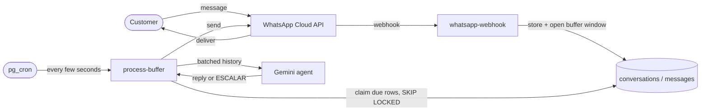
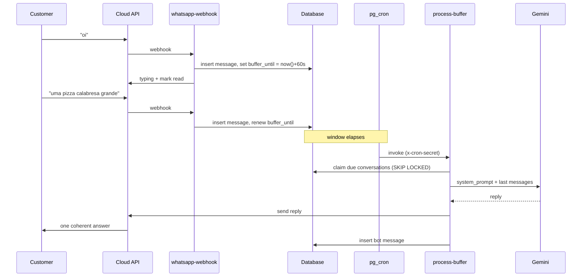
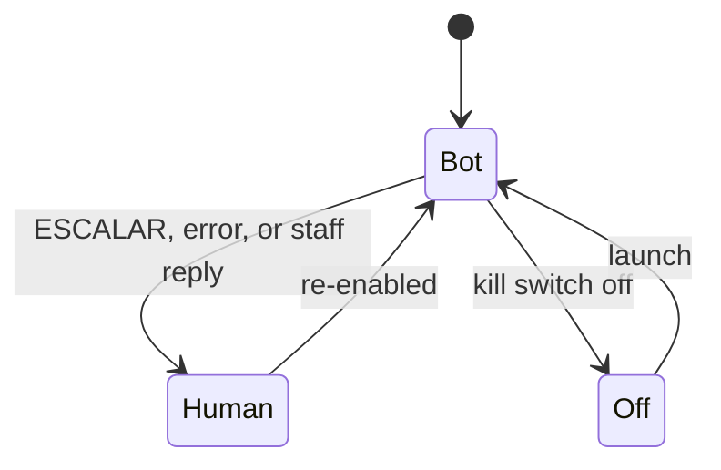
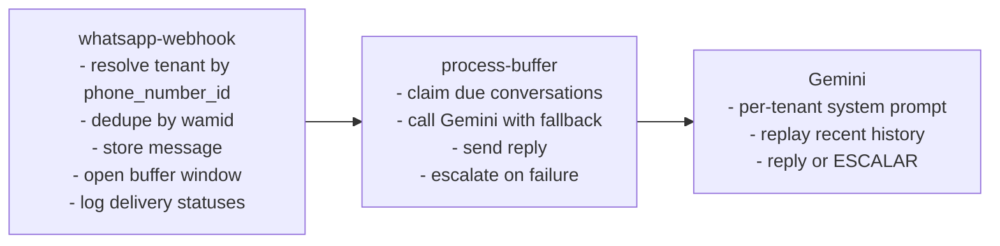

# Diagrams

All diagrams use [Mermaid](https://mermaid.js.org/), which GitHub renders natively.

---

## System architecture

---

## Sequence: a batched reply

The debounce window is the key beat — the agent acts only once the customer pauses.

---

## Hand-off state

How a conversation moves between bot and human.

---

## Component responsibilities

