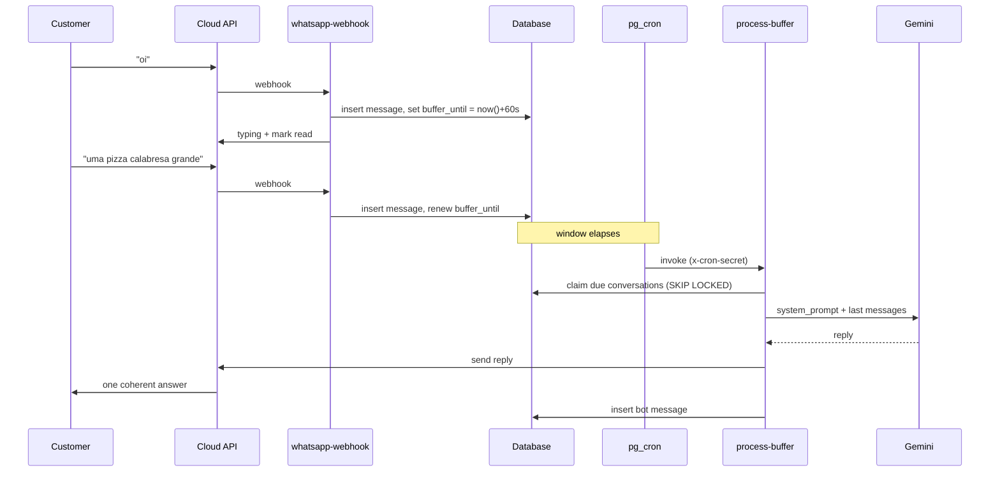
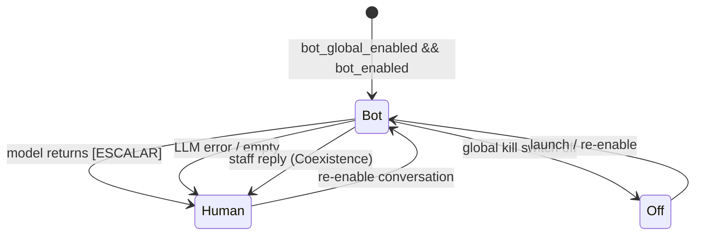
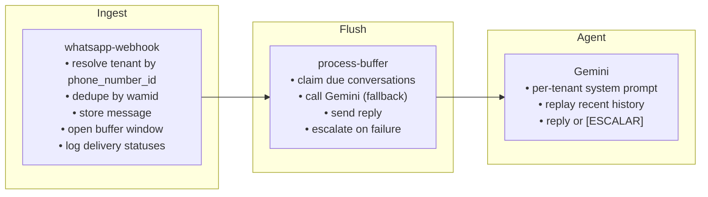

# Diagrams

All diagrams use [Mermaid](https://mermaid.js.org/), which GitHub renders natively.

---

## System architecture

```mermaid
flowchart TB
    Customer["Customer"]

    subgraph Meta
        Cloud["WhatsApp Cloud API"]
    end

    subgraph Supabase
        WH["whatsapp-webhook<br/>(Edge Function)"]
        PB["process-buffer<br/>(Edge Function)"]
        Cron["pg_cron"]
        Claim["claim_buffered_conversations()<br/>FOR UPDATE SKIP LOCKED"]
        DB[("conversations / messages")]
    end

    subgraph Google
        Gemini["Gemini (model fallback)"]
    end

    Customer -->|messages| Cloud
    Cloud -->|webhook| WH
    WH -->|store msg + set buffer_until| DB
    WH -->|typing + read receipt| Cloud
    Cron -->|interval| PB
    PB --> Claim
    Claim -->|due, unlocked rows| DB
    PB -->|last ~10 messages| Gemini
    Gemini -->|reply or [ESCALAR]| PB
    PB -->|send reply| Cloud
    Cloud -->|deliver| Customer
```

---

## Sequence: a batched reply

The debounce window is the key beat — the agent acts only once the customer pauses.



---

## Hand-off state

How a conversation moves between bot and human.



---

## Component responsibilities


